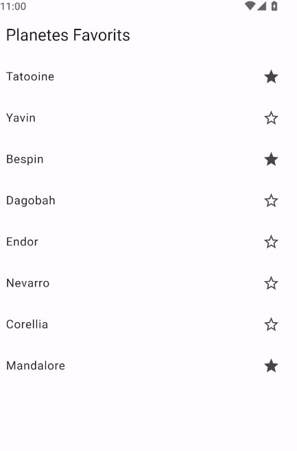

# Unidad 7. Persistencia con Floor.


La persistencia de los datos es una pieza fundamental en el desarrollo de aplicaciones, para la que se nos presentan opciones diversas, como el almacenamiento local haciendo uso de archivos, ya sean en texto plano, binarios o estructurados, bases de datos de diferentes tipos, o bien directamente en la nube.

En este apartado, vamos a centrarnos en la persistencia mediante bases de datos. Concretamente, la base de datos SQLite con la librería *Floor*.


[1. La librería Floor](#_apartado1)

[2. Entidades](#_apartado2)

[3. Objetos de Acceso a Datos](#_apartado3)

[4. Creación de la BD](#_apartado4)

[5. Utilización del código generado](#_apartado5)


# <a name="_apartado1"></a>1. La librería Floor

La librería [Floor](https://pub.dev/packages/floor) en Flutter proporciona una capa de abstracción para la base de datos SQLite, al igual que lo hacen las herramientas de mapeado objeto-relacional (ORM), como puedan ser Hibernate en tecnologías Java, o Room en Android. Este último ORM es en el que se inspira Floor.

Floor proporciona mapeado automático entre instancias de clases y registros de la base de datos, y ofrece también la posibilidad de controlar la base de datos con SQL.

Tal y como se indica en la documentación, la forma de trabajar con Floor sigue el siguiente esquema:

1. Configuración de las dependencias necesarias
   
2. Creación de las entidades
3. Creación de las clases de acceso a datos (DAO, Data Access Object)
4. Creación de la base de datos
5. Ejecución del generador automático de código
6. Utilización del código generado

La idea de base de Room es poder definir las distintas clases que representarán las tablas de la base de datos, así como las clases de acceso a datos, que definirán las posibles acciones que podemos realizar sobre estos datos. Con estas definiciones, la misma librería nos ofrecerá herramientas para poder generar el código de acceso a la base de datos para utilizarlo en la aplicación.

Vamos a ver, a modo de ejemplo cómo haríamos una pequeña aplicación para gestionar una lista de favoritos, de forma muy sencilla.

## Presentación de la aplicación

La aplicación que vayamos a hacer constará de una lista de planetas, que se mostrarán como un `ListView`, donde los distintos items se podrán marcar como favoritos con el icono de una estrella.

El aspecto que tendrá ésta será el siguiente:

---
POR HACER


---

Hay que decir que la lista, para simplificar, será una lista fija de planetas, definida en el código, y que en la base de datos almacenaremos otra lista de favoritos, por lo que marcar un planeta como favorito será realizar una inserción en la base de datos y desmarcarlo supondrá un borrado. Para mostrar la lista de planetas con los favoritos contrastaremos ambas listas.

## Configuración de las dependencias

En primer lugar, vamos a ver las dependencias que habrá que instalar en nuestro proyecto.

Para trabajar con Floor necesitaremos la misma librería `floor`, como dependencia del *runtime*, y las librerías `floor_generator` y `build_runner` como dependencias de *desarrollo*. La diferencia entre unas y otras es que las del *runtime* se incorporan a la aplicación, mientras que las de *desarrollo* no lo hacen, pero se necesitan para el desarrollo en sí de la aplicación.

Estas librerías de *desarrollo* que necesitamos para `Floor` son las que nos permitirán generar el código de acceso a su base de datos. Recordemos que `Floor` es una capa de abstracción para el acceso a `SQLite`, por lo que nosotros, como veremos, definiremos las entidades de la base de datos y las operaciones que se pueden realizar sobre las mismas. Una vez definidas, necesitaremos que alguien genere el código para acceder a la base de datos, y de esto es de lo que se encargan `floor_generator` y `build_runner`. Si has trabajado con Android y Room, estas librerías serían como la herramienta KAPT para procesar las anotaciones.

Yendo a la parte práctica, en primer lugar, **generaríamos el proyecto** e incorporaremos las dependencias del runtime:

```
flutter pub add floor
```

y las dependencias de desarrollo:

```
flutter pub add dev:floor_generator
flutter pub add dev:build_runner
```

Como vemos, para añadir una dependencia de desarrollo, simplemente debemos añadir dev: frente al nombre del paquete.

Esto nos habrá añadido al archivo pubspec.yaml algo parecido a lo siguiente:

```yaml
dependencies:
  ...
  floor: ^1.4.2

dev_dependencies:
  ...
  floor_generator: ^1.4.2
  build_runner: ^2.4.9
```

# <a name="_apartado2"></a>2. Entidades

## Creación de las entidades

Floor, como otros ORMs, trabaja mediante anotaciones para definir los distintos elementos que gestiona. Estas anotaciones se convertirán en código de acceso a la base de datos, generado posteriormente por la herramienta *floor_generator*.

Las **entidades** (*Entities*) son clases que nos ayudan a representar los objetos a almacenar en la base de datos. Cada entidad se corresponde con una tabla de la base de datos, y cada instancia de la entidad con una fila de la tabla.

Para definir una clase como entidad, debemos anotarla con `@entity`, y definir los campos que se corresponderán con las columnas de la tabla, incluyendo uno o más campos para la clave principal. Esta clave la anotaremos como `@primaryKey`.

En nuestro ejemplo, vamos a definir una única entidad, que contendrá un par de propiedades: un `id` numérico (que será la clave principal), y una cadena de texto con el nombre del planeta.

El código para definir la entidad empezará con lo siguiente:

```dart
/* Fichero lib/model/planeta.dart */

import 'package:floor/floor.dart';

@entity
class Planeta {
  @primaryKey
  final int id;
  final String? nombre;

  Planeta({required this.id, required this.nombre});
  ...
  }
```

Vemos algunos detalles:

- Hemos añadido la anotación `@entity` a la clase `Planeta`, para indicar que esta clase es una entidad, y por tanto, será una tabla de la base de datos.
- 
La propiedad `final int id` se ha anotado con `@primaryKey`, para indicar que se trata de la clave principal.
Hemos añadido un constructor con argumentos con nombre, que recibe id y nombre.

Este archivo se ha guardado como `planeta.dart`, en la carpeta `lib/model/`, ya que se trata de parte del Modelo de datos. También es habitual crear una carpeta específica para las entidades, llamada entities.

Cuando definimos una entidad, podemos añadirle algunos parámetros a su creación, como por ejemplo:

- Definir el nombre específico de la tabla (si no se indica será el mismo que la clase):
  
```dart
// Definimos un nombre de tabla diferente al de la clase
@Entity(tableName: 'nombreTabla')
class nombreClase{...}
```

- Definir una clave principal compuesta:

```dart
@entity(primaryKeys: ['id', 'nombre'])
...
```

- Declarar claves externas, con la propiedad `foreingKey`:

```dart  
@Entity(
  tableName: 'nombreTabla',
  foreignKeys: [
    ForeignKey(
      childColumns: ['propiedad_en_esta_entidad'],
      parentColumns: ['propiedad_en_la_entidad_referenciada'],
      entity: NombreEntidadReferenciada,
    )
  ],
)
class Entidad {...}
```

- Establecer propiedades de una columna concreta de la tabla, como el nombre de la propiedad en ésta:
  
```dart
class NombreEntidad{
    // La propiedad nombrePropiedad en la tabla será nombre_en_la_tabla
    @ColumnInfo(name: 'nombre_en_la_tabla')
    final int nombrePropiedad;
    ...
}
```

[Documentación oficial de Floor](https://pinchbv.github.io/floor/entities/)

Volviendo a nuestra definición de la entidad, vamos a sobreescribir el operador de comparación `==`, de modo que dos objetos de tipo planeta sean iguales cuando su `id` y su nombre sean el `mismo`. Si no sobreescribimos este método, dos objetos serían iguales sólo si se tratara de la misma referencia. Este método se utilizará posteriormente para determinar si una lista de planetas contiene un planeta concreto:

```dart
  @override
  bool operator ==(Object other) {
    // Comparamos que sean de la misma clase y que el 
    // valor de las propiedades sea el mismo
    return other is Planeta && other.id == id && other.nombre == nombre;
  }
```