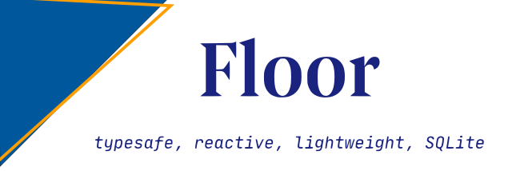
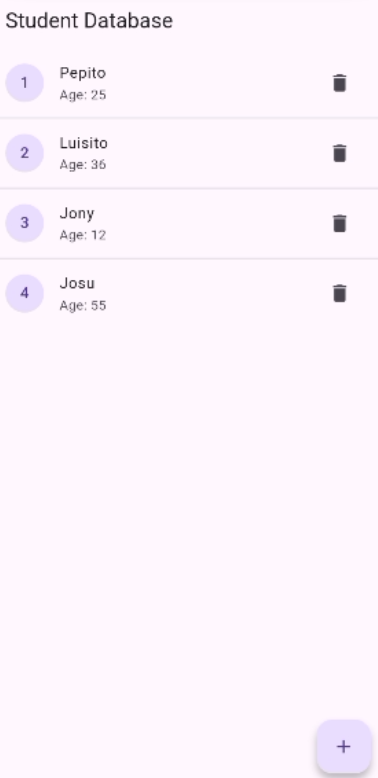

# Unidad 7. Persistencia con Floor.



La persistencia de los datos es una pieza fundamental en el desarrollo de aplicaciones, para la que se nos presentan opciones diversas, como el almacenamiento local haciendo uso de archivos, ya sean en texto plano, binarios o estructurados, bases de datos de diferentes tipos, o bien directamente en la nube.

En este apartado, vamos a centrarnos en la persistencia mediante bases de datos. Concretamente, la base de datos SQLite con la librería *Floor*.


[1. La librería Floor](#_apartado1)

[2. Entidades](#_apartado2)

[3. Objetos de Acceso a Datos](#_apartado3)

[4. Creación de la BD](#_apartado4)

[5. Utilización del código generado](#_apartado5)

[6. Aplicación Floor Estudiantes](#_apartado6)


# <a name="_apartado1"></a>1. La librería Floor

La librería [Floor](https://pub.dev/packages/floor) en Flutter proporciona una capa de abstracción para la base de datos SQLite, al igual que lo hacen las herramientas de mapeado objeto-relacional (ORM), como puedan ser Hibernate en tecnologías Java, o Room en Android. Este último ORM es en el que se inspira Floor.

Floor proporciona mapeado automático entre instancias de clases y registros de la base de datos, y ofrece también la posibilidad de controlar la base de datos con SQL.

Tal y como se indica en la documentación, la forma de trabajar con Floor sigue el siguiente esquema:

1. Configuración de las dependencias necesarias
   
2. Creación de las entidades
3. Creación de las clases de acceso a datos (DAO, Data Access Object)
4. Creación de la base de datos
5. Ejecución del generador automático de código
6. Utilización del código generado

La idea de base de Room es poder definir las distintas clases que representarán las tablas de la base de datos, así como las clases de acceso a datos, que definirán las posibles acciones que podemos realizar sobre estos datos. Con estas definiciones, la misma librería nos ofrecerá herramientas para poder generar el código de acceso a la base de datos para utilizarlo en la aplicación.

Vamos a ver, a modo de ejemplo cómo haríamos una pequeña aplicación para gestionar una lista de favoritos, de forma muy sencilla.

## Presentación de la aplicación

La aplicación que vayamos a hacer constará de una lista de planetas, que se mostrarán como un `ListView`, donde los distintos items se podrán marcar como favoritos con el icono de una estrella.

El aspecto que tendrá ésta será el siguiente:

---
POR HACER


---

Hay que decir que la lista, para simplificar, será una lista fija de planetas, definida en el código, y que en la base de datos almacenaremos otra lista de favoritos, por lo que marcar un planeta como favorito será realizar una inserción en la base de datos y desmarcarlo supondrá un borrado. Para mostrar la lista de planetas con los favoritos contrastaremos ambas listas.

## Configuración de las dependencias

En primer lugar, vamos a ver las dependencias que habrá que instalar en nuestro proyecto.

Para trabajar con Floor necesitaremos la misma librería `floor`, como dependencia del *runtime*, y las librerías `floor_generator` y `build_runner` como dependencias de *desarrollo*. La diferencia entre unas y otras es que las del *runtime* se incorporan a la aplicación, mientras que las de *desarrollo* no lo hacen, pero se necesitan para el desarrollo en sí de la aplicación.

Estas librerías de *desarrollo* que necesitamos para `Floor` son las que nos permitirán generar el código de acceso a su base de datos. Recordemos que `Floor` es una capa de abstracción para el acceso a `SQLite`, por lo que nosotros, como veremos, definiremos las entidades de la base de datos y las operaciones que se pueden realizar sobre las mismas. Una vez definidas, necesitaremos que alguien genere el código para acceder a la base de datos, y de esto es de lo que se encargan `floor_generator` y `build_runner`. Si has trabajado con Android y Room, estas librerías serían como la herramienta KAPT para procesar las anotaciones.

Yendo a la parte práctica, en primer lugar, **generaríamos el proyecto** e incorporaremos las dependencias del runtime:

```
flutter pub add floor
```

y las dependencias de desarrollo:

```
flutter pub add dev:floor_generator
flutter pub add dev:build_runner
```

Como vemos, para añadir una dependencia de desarrollo, simplemente debemos añadir dev: frente al nombre del paquete.

Esto nos habrá añadido al archivo pubspec.yaml algo parecido a lo siguiente:

```yaml
dependencies:
  ...
  floor: ^1.4.2

dev_dependencies:
  ...
  floor_generator: ^1.4.2
  build_runner: ^2.4.9
```

# <a name="_apartado2"></a>2. Entidades

## Creación de las entidades

Floor, como otros ORMs, trabaja mediante anotaciones para definir los distintos elementos que gestiona. Estas anotaciones se convertirán en código de acceso a la base de datos, generado posteriormente por la herramienta *floor_generator*.

Las **entidades** (*Entities*) son clases que nos ayudan a representar los objetos a almacenar en la base de datos. Cada entidad se corresponde con una tabla de la base de datos, y cada instancia de la entidad con una fila de la tabla.

Para definir una clase como entidad, debemos anotarla con `@entity`, y definir los campos que se corresponderán con las columnas de la tabla, incluyendo uno o más campos para la clave principal. Esta clave la anotaremos como `@primaryKey`.

En nuestro ejemplo, vamos a definir una única entidad, que contendrá un par de propiedades: un `id` numérico (que será la clave principal), y una cadena de texto con el nombre del planeta.

El código para definir la entidad empezará con lo siguiente:

```dart
/* Fichero lib/model/planeta.dart */

import 'package:floor/floor.dart';

@entity
class Planeta {
  @primaryKey
  final int id;
  final String? nombre;

  Planeta({required this.id, required this.nombre});
  ...
  }
```

Vemos algunos detalles:

- Hemos añadido la anotación `@entity` a la clase `Planeta`, para indicar que esta clase es una entidad, y por tanto, será una tabla de la base de datos.
- 
La propiedad `final int id` se ha anotado con `@primaryKey`, para indicar que se trata de la clave principal.
Hemos añadido un constructor con argumentos con nombre, que recibe id y nombre.

Este archivo se ha guardado como `planeta.dart`, en la carpeta `lib/model/`, ya que se trata de parte del Modelo de datos. También es habitual crear una carpeta específica para las entidades, llamada entities.

Cuando definimos una entidad, podemos añadirle algunos parámetros a su creación, como por ejemplo:

- Definir el nombre específico de la tabla (si no se indica será el mismo que la clase):
  
```dart
// Definimos un nombre de tabla diferente al de la clase
@Entity(tableName: 'nombreTabla')
class nombreClase{...}
```

- Definir una clave principal compuesta:

```dart
@entity(primaryKeys: ['id', 'nombre'])
...
```

- Declarar claves externas, con la propiedad `foreingKey`:

```dart  
@Entity(
  tableName: 'nombreTabla',
  foreignKeys: [
    ForeignKey(
      childColumns: ['propiedad_en_esta_entidad'],
      parentColumns: ['propiedad_en_la_entidad_referenciada'],
      entity: NombreEntidadReferenciada,
    )
  ],
)
class Entidad {...}
```

- Establecer propiedades de una columna concreta de la tabla, como el nombre de la propiedad en ésta:
  
```dart
class NombreEntidad{
    // La propiedad nombrePropiedad en la tabla será nombre_en_la_tabla
    @ColumnInfo(name: 'nombre_en_la_tabla')
    final int nombrePropiedad;
    ...
}
```

[Documentación oficial de Floor](https://pinchbv.github.io/floor/entities/)

Volviendo a nuestra definición de la entidad, vamos a sobreescribir el operador de comparación `==`, de modo que dos objetos de tipo planeta sean iguales cuando su `id` y su nombre sean el `mismo`. Si no sobreescribimos este método, dos objetos serían iguales sólo si se tratara de la misma referencia. Este método se utilizará posteriormente para determinar si una lista de planetas contiene un planeta concreto:

```dart
  @override
  bool operator ==(Object other) {
    // Comparamos que sean de la misma clase y que el 
    // valor de las propiedades sea el mismo
    return other is Planeta && other.id == id && other.nombre == nombre;
  }
```

# <a name="_apartado3"></a>3. Objetos de Acceso a Datos

Para mantener el principio de separación de problemas, el acceso y la manipulación de la información a las entidades no suele realizarse de forma directa, sino a través de objetos de acceso a datos (DAO o Data Access Objects).

Para ello, los **DAO** se especifican con **interfaces o clases abstractas con anotaciones**, mediante las cuales indicaremos en Floor qué operaciones pueden realizarse sobre la base de datos. El hecho de utilizar interfaces o clases abstractas con la firma de los métodos para las operaciones permite a la herramienta `floor_generator` generar el código apropiado para la interacción con la base de datos.

Estos métodos devolverán bien un objeto de tipo `Future` o un `Stream`.

Para definir una clase abstracta como DAO hacemos uso de la anotación `@dao`, y para indicar una consulta, utilizaremos la anotación `@Query`. Otras anotaciones que indican operaciones de manipulación de la base de datos serían `@insert`, `@update` o `@delete`.

En nuestro caso, crearemos el archivo `planeta_dao.dart` en la `carpeta lib/model`, aunque también es habitual crear una carpeta dao específica para este tipo de clases.

En nuestra clase DAO (`PlanetaDao`), que será una clase abstracta crearemos los métodos `findAll()`, para obtener todos los registros de la base de datos, e `insertPlanet` y `deletePlanet`, para añadir y eliminar un planeta en la tabla, respectivamente. Vemos cómo indicaríamos las diferentes anotaciones para ello:

```dart
// lib/model/planeta_dao.dart

import 'package:floor/floor.dart';
import 'package:planetas/model/planeta.dart';

@dao
abstract class PlanetaDao {
  @Query('SELECT * FROM Planeta')
  Stream<List<Planeta>> findAll();

  @insert
  Future<void> insertPlanet(Planeta planeta);

  @delete
  Future<void> deletePlanet(Planeta planeta);
}
```

Como vemos, el método `findAll` se corresponde con una consulta `SELECT`, que indicamos como parámetro en la misma anotación `@Query`.

Además, es importante observar que esta consulta devuelve un `Stream` con la lista de los planetas resultante de la consulta. Esto permitirá enlazar un `StreamBuilder`, y disponer de la interfaz sincronizada permanentemente con el contenido de la base de datos.

# <a name="_apartado4"></a>4. Creación de la Base de Datos

Una vez tenemos definidas las entidades y los DAO para acceder a éstas, debemos generar la clase para la base de datos, que será una clase descendente de `FloorDatabase` y en la que indicaremos con qué entidades y DAO puede trabajar. Para ello utilizaremos la anotación `@Database`, con las propiedades `entities` y `version`. Este atributo `version`, se utiliza para identificar la versión de la base de datos que utilizamos. Si modificamos el esquema de la base de datos (añadiendo o eliminando propiedades a las entidades), deberemos modificar el número de versión, además de indicar cómo realizar la migración entre versiones.

En este archivo, habrá que importar, entre otras, las librerías de *Floor*, las clases DAO y las entidades definidas, así como la librería *sqflite*. Aunque no utilizaremos directamente esta y la librería *Floor*, éstas son requeridas por el código generado.

El código que generaremos posteriormente con la herramienta `floor_generator` se crea en el archivo `database.g.dart`, y se importa a nuestro código mediante la directiva `part`. Ésta es similar a un `import`, pero con la diferencia de que `part` inyecta el contenido de otro archivo en la ubicación donde se define. Como su nombre indica, sirve para decir que un archivo es parte del archivo actual.

Teniendo todo esto en cuenta, el código de la base de datos nos quedaría:

```dart
// database.dart

// Paquetes necessarios
import 'dart:async';
import 'package:floor/floor.dart';
import 'package:sqflite/sqflite.dart' as sqflite;

import 'package:floor/floor.dart';
import 'package:planetas/model/planeta.dart';
import 'package:planetas/model/planeta_dao.dart';

// Injectem el codi generat
part 'database.g.dart'; 

@Database(version: 1, entities: [Planeta])
abstract class AppPlanetasDB extends FloorDatabase {
  PlanetaDao get planetaDao;
}
```

***
Como vemos, esta clase nos ofrece el método `get planetaDao`, que nos devuelve una referencia a la clase DAO, mediante la cual operaremos con la tabla correspondiente.
***

## Ejecución del generador

Una vez que tenemos la base de datos preparada, y las entidades y clases DAO definidas, es hora de generar automáticamente el código para acceder a la base de datos. De esto se encargaba el paquete `build_runner`, que generará el archivo `database.g.dart`.

Para ejecutar el generador de código hacemos lo siguiente:

```
dart run build_runner build
```

Si aparecen errores habrá que resolverlos en ese momento, y al final, si todo va bien, nos informará con un mensaje parecido a éste:

```
[INFO] Succeeded after 13.7s with 35 outputs (78 actions)
```

Por otra parte, si deseamos regenerar el código automáticamente siempre que cambie un archivo, utilizaríamos `watch` en lugar de `build`:

```
dart run build_runner watch  
```
 

# <a name="_apartado5"></a>5. Utilización del código generado

Por último, una vez tenemos el código de acceso a la base de datos generado, podemos obtener una instancia de la clase generada `$FloorNomDatabase`, que nos dará acceso a un `builder` de la base de datos.

El nombre de esta clase está compuesto por `$Floor` y el nombre de la clase de la base de datos. En nuestro caso será `$FloorAppPlanetasDB`.

A fin de separar la lógica de negocio de la interfaz y mantener el estado de la aplicación, seguiremos el patrón de diseño *Provider*, visto en la unidad anterior. Así pues, será necesario incorporar las librerías, preparar el repositorio para centralizar el acceso al modelo, el *Provider* para mantener el estado, y hacer uso de él en la aplicación. Vamos por partes.

## Incorporación de librerías y creación de la estructura necesaria

Antes de continuar, añadiremos la librería *Provider* como dependencia:

```
flutter pub add provider
```

Y crearemos el resto de carpetas para organizar el código: `lib/repository` para el archivo `favoritos_repository.dart` y `lib/provider`, para el archivo `favoritos_provider.dart`.

## Creación del repositorio

La clase Repository (`FavoritosRepository`) que nos proporciona el acceso al modelo, ofrecerá cuatro métodos: `conectaDB()`, para obtener una instancia única de la base de datos (usando `Singleton`), y los métodos `findAll()`, `insertPlanet()`, y `deletePlanet()`, que proporcionan acceso a los métodos correspondientes.

La clase definirá dos propiedades: la referencia a la base de datos y el DAO de la entidad. En el propio constructor de la clase se inicializarán estas referencias. Vemos su código:

```dart
import 'package:planetas/model/database.dart';
import 'package:planetas/model/planeta_dao.dart';

class FavoritosRepository {
  AppPlanetasDB? _database; // Referencia a la BD
  PlanetaDao? _dao;         // Referencia al DAO

  FavoritosRepository._();    // Constructor privado

  // Instancia única del repositorio. La podemos crear directamente
  // en la inicialización
  static final FavoritosRepository _instance = FavoritosRepository._();

  // Cuando se nos pida el repositorio, se devuelve la instancia única.
  factory FavoritosRepository() {
    return _instance;
  }

  // Connexión a la base de datos
  Future<void> connectaDB() async {
    if (_database == null) {
      // Creamos la BD únicamente si no se ha creado ya
      _database = await $FloorAppPlanetasDB
          .databaseBuilder('planetas_database.db')
          .build();

      // Creamos el DAO
      _dao = _database?.planetaDao;
    }
  }
  ...
}
```

Como podemos ver, hacemos uso de la clase `$FloorAppPlanetasDB`, quien a través del método `build` del componente `databaseBuilder` nos ofrece la instancia de la base de datos. Con el fin de garantizar que sólo exista una referencia a ésta, comprobamos que ésta sea nula antes de crearla.

El resto de métodos de esta clase (`findAll`, `insertPlanet` y `deletePlanet`) ofrecerán acceso a métodos del *DAO* a través de su referencia:

```dart
  // Añadimos como métodos del repositorio los propios de la clase DAO
  Stream<List<Planeta>> findAll() {
    return _dao?.findAll() ?? const Stream.empty();
  }

  Future<void> insertPlanet(Planeta planeta) {
    return _dao?.insertPlanet(planeta) ?? Future.value();
  }

  Future<void> deletePlanet(Planeta planeta) {
    return _dao?.deletePlanet(planeta) ?? Future.value();
  } 
```

# Creación del Provider

Siguiendo con el patrón *Provider*, es hora de crear ahora el componente principal, el propio `Provider`.

Instalamos la librería:
```
flutter pub add provider
```

En primer lugar, el *Provider* se define como un `mixin` de `ChangeNotifier`, y en él definimos una referencia privada en el repositorio:

```dart
class FavoritosProvider with ChangeNotifier {
  final FavoritosRepository _repository = FavoritosRepository();

  ...
}
```

Esta clase ofrecerá también el acceso a los métodos del repositorio:

```dart
  Stream<List<Planeta>>? findAll() {
    return _repository.findAll();
  }

  Future<void> insertPlanet(Planeta planeta) async {
    await _repository.insertPlanet(planeta);
    notifyListeners();
  }

  Future<void> deletePlanet(Planeta planeta) async {
    await _repository.deletePlanet(planeta);
    notifyListeners();
  }
```

- El método `findAll` devolverá un `Stream` con la lista de planetas, que obtiene por el mismo método del repositorio. Desde las vistas, haremos uso de un `StreamBuilder` para estar pendientes de los cambios en el `Stream`. De esta forma, siempre que haya un cambio en la base de datos, éste se propagará directamente en la interfaz.
  
- Los métodos `insertPlanet` y `deletePlanet` hacen uso de los métodos correspondientes del repositorio, y esperan que estos hayan finalizado la inserción o borrado en la base de datos. Una vez lo han hecho, notificarán de los cambios a todos los elementos de interfaz que estuvieran escuchando.

Tal y como lo hemos definido, hay todavía un pequeño inconveniente, y es que si enlazamos un `StreamBuilder` en la interfaz a este `Stream` fruto del `findAll`, hasta que no se añada o elimine algún elemento no se refrescaría la interfaz. Para resolver esto, vamos a forzar una carga inicial que provoque un cambio de estado y por tanto una notificación a los elementos que estén suscritos.

Para ello, nos definiremos una lista privada de favoritos, inicialmente vacía, y en el constructor del Provider forzaremos una invocación al método `findAll()`, de forma que, una vez que tenga los resultados, actualice esta lista y emita la correspondiente notificación. Como queremos obtener un `Future` en lugar de un `Stream`, haremos uso de la propiedad `first` del `Stream`, que devuelve un `Future` con el primer elemento del `Stream` y deja de escucharlo.

El código será el siguiente:

```dart
class FavoritosProvider with ChangeNotifier {
  final FavoritosRepository _repository = FavoritosRepository();

  // Lista de favoritos para la carga inicial
  // Nos servirá para emitir la primera notificación de cambio de estado
  List<Planeta> _favoritos = [];

  FavoritosProvider() {
    // En el constructor hacemos una carga de los favoritos
    _carregaFavoritos();
  }

  Future<void> _carregaFavoritos() async {
    // Esperamos a tener una conexión lista en la BD
    await _repository.connectaDB();

    // Obtenemos el primer elementos del Stream que obtenemos con un findall

    final listaFavoritos = await _repository.findAll().first;
    _favoritos = listaFavoritos;
    notifyListeners();
  }

  ...
}
```

Con esto ya podremos continuar con el último paso: la generación de la interfaz.

## Creación de la interfaz de usuario

Siguiendo con la estructura habitual, crearemos una carpeta `lib/screens` para ubicar las diferentes vistas de la interfaz.

Dentro de ella crearemos el widget principal de nuestra aplicación, que será un widget sin estado, y crearemos como propiedades de la clase la lista de todos los planetas posibles:

```dart
class ListaPlanetas extends StatelessWidget {
  ListaPlanetas({super.key});

  // Declarem una llista estàtica de planetes
  // En la base de dades, només guardarem els favorits
  final List<Planeta> planetes = [
    Planeta(id: 1, nombre: "Tatooine"),
    Planeta(id: 2, nombre: "Yavin"),
    Planeta(id: 3, nombre: "Bespin"),
    Planeta(id: 4, nombre: "Dagobah"),
    Planeta(id: 5, nombre: "Endor"),
    Planeta(id: 6, nombre: "Nevarro"),
    Planeta(id: 7, nombre: "Corellia"),
    Planeta(id: 8, nombre: "Mandalore"),
  ];

   ...

}
```

Vemos ahora cómo abordaríamos la construcción del widget con el método build, presentando su código y después la explicación:

```dart
 @override
  Widget build(BuildContext context) {
    // Definim la referència al Provider
    var favoritProvider = Provider.of<FavoritosProvider>(context);

    return StreamBuilder<List<Planeta>>(
      stream: favoritProvider.findAll(),
      builder: (context, snapshot) {
        debugPrint(snapshot.connectionState.toString());
        if (snapshot.hasData) {
          // El snapshot contendrá la lista de planetas favorita

          // Construimos la lista de planetas, con un ListView Builder
          // Cada item será un ListTile, que contendrá como "trailing"
          // una estrella con la que podremos interactuar para marcar o
          // desmarcar el planeta como favorito.
          return ListView.builder( 
              itemCount: planetas.length,
              itemBuilder: (BuildContext context, int index) {
                // Calculamos si el planeta es favorito o no
                bool esFavorito = _esFavorito(
                  planeta: planetas[index],
                  planetas: snapshot.data ?? [],
                );
                debugPrint("${planetas[index].nombre} es favorito: $esFavorito");
                return ListTile(
                    title: Text(planetas[index].nombre ?? ""),
                    trailing: MyStar(
                      planeta: planetas[index],
                      esFavorito: esFavorito,
                      onTap: () {
                        if (esFavorito) {
                          favoritProvider.deletePlanet(planetas[index]);
                        } else {
                          favoritProvider.insertPlanet(planetas[index]);
                        }
                      },
                    ));
              });
        } else {
          return const Center(child: CircularProgressIndicator());
        }
      },
    );
  }
```

En este método, lo primero que hacemos es obtener una referencia al Provider (clase `FavoritosProvider`):

```dart
var favoritosProvider = Provider.of<FavoritosProvider>(context);
```

Y hacemos uso de un widget `StreamBuilder` parametrizado en una lista de planetas. El `Stream` al que estará asociado éste será el que obtenemos del método `findAll()` del Provider:

```dart
return StreamBuilder<List<Planeta>>(
    stream: favoritosProvider.findAll(),
    builder: (context, snapshot) {
      if (snapshot.hasData) {
        ...
      }
  }
)
```

Con esto, cuando se emita cualquier evento por el *Stream*, el `builder` recibirá un `snapshot` y comprobará si tiene o no datos. En caso afirmativo, estos datos serán la lista de planetas favoritos, con la que ya podremos refrescar la vista.

Para redibujar esta lista de planetas, haremos uso de un `ListView.builder`, que recorrerá la lista general de planetas, y comprobará si cada planeta es favorito o no (si se encuentra en la lista que hemos obtenido en `Snapshot` o no). Si se trata de un elemento que se encuentra en la lista, se dibujará un icono con una estrella llena, mientras que si el elemento no se encuentra en la lista de favoritos, dibujará el icono de la estrella solo con los bordes. Para crear esta estrella, hemos diseñado un widget personalizado `MyStar`, que recibe un `String` con el nombre del planeta, un booleano indicando si es favorito o no, y una función de `callback`, que hemos llamado `onTap` y que se invocará cuando se haga tap sobre la estrella. El código de este callback consistirá únicamente en una inserción o un borrado sobre el repositorio (y por tanto sobre la base de datos):

```dart
      builder: (context, snapshot) {
        debugPrint(snapshot.connectionState.toString());
        if (snapshot.hasData) {
          // El snapshot contendrá la lista de planetas favorita

          // Construimos la lista de planetas, con un ListView Builder
          // Cada item será un ListTile, que contendrá como "trailing"
          // una estrella con la que podremos interactuar para marcar o
          // desmarcar el planeta como favorito.
          return ListView.builder( 
              itemCount: planetas.length,
              itemBuilder: (BuildContext context, int index) {
                // Calculamos si el planeta es favorito o no
                bool esFavorito = _esFavorito(
                  planeta: planetas[index],
                  planetas: snapshot.data ?? [],
                );
                debugPrint("${planetas[index].nombre} es favorito: $esFavorito");
                return ListTile(
                    title: Text(planetas[index].nombre ?? ""),
                    trailing: MyStar(
                      planeta: planetas[index],
                      esFavorito: esFavorito,
                      onTap: () {
                        if (esFavorito) {
                          favoritosProvider.deletePlanet(planetas[index]);
                        } else {
                          favoritosProvider.insertPlanet(planetas[index]);
                        }
                      },
                    ));
              });
        } else {
          return const Center(child: CircularProgressIndicator());
        }
      },
```

La función `_esFavorito` hará uso del método `contains` de la clase `List` para determinar si un planeta determinado se encuentra en la lista de favoritos o no. Este método, internamente hace uso del operador de igualdad (operator `==`) que modificamos en la entidad para comparar los elementos proporcionados.

```dart
  bool _esFavorito({required Planeta planeta, required List<Planeta> planetas}) {
    return planetas.contains(planeta);
  }
```

El widget `MyStar`, por su parte tendrá el siguiente código:

```dart
class MyStar extends StatelessWidget {
  const MyStar({super.key, this.planeta, this.esFavorito, this.onTap});

  final Planeta? planeta;
  final bool? esFavorito;
  final Function? onTap;

  @override
  Widget build(BuildContext context) {
    Widget? star;

    if (esFavorito ?? false) {
      star = const Icon(Icons.star);
    } else {
      star = const Icon(Icons.star_border_outlined);
    }

    return GestureDetector(
      child: star,
      onTap: () {
        onTap!();
      },
    );
  }
}
```

Como podemos observar, aparte de utilizar un icono u otro para mostrar la estrella, hacemos uso de un `GestureDetector` para detectar el tap sobre el icono e invocar el `callback` que se nos ha proporcionado para añadir o eliminar el favorito de la lista.

Por último, recordemos también que, en este caso, como estamos haciendo uso de un *Provider*, habrá que rodear la aplicación `Material` con un `ChangeNotifyProvider`:

```dart
class MyApp extends StatelessWidget {
  const MyApp({super.key});

  @override
  Widget build(BuildContext context) {
    return ChangeNotifierProvider(
      create: (BuildContext context) => FavoritProvider(),
      child: MaterialApp(
        debugShowCheckedModeBanner: false,
        title: 'Planetas favoritos',
        home: Scaffold(
            appBar: AppBar(title: const Text("Planetas Favoritos")),
            body: ListaPlanetas()),
      ),
    );
  }
}
```

## Instalación y ejecución de la aplicación

Por último, con `flutter run` podemos lanzar nuestra aplicación sobre un dispositivo **Android**, y hacer uso de la base de datos *SQLite* integrada en él.

Aunque la página de la librería en `pub.dev` indica que la librería es compatible con las plataformas Android, iOS y MacOS, podemos lanzar el proyecto y verlo funcionando también en Linux.

Para ello, será necesario instalar los paquetes `sqlite` y `libsqlite3-dev` con:

```
$ sudo apt install sqlite libsqlite3-dev
```

# <a name="_apartado6"></a>6. Aplicación Floor Estudiantes

Vamos a seguir los pasos que hemos visto en los apartados anteriores para crear una aplicación de gestión de estudiantes.

## Configuración de las dependencias

Una vez creado nuestro nuevo proyecto de flutter vamos a añadirle las dependencias necesarias, de runtime:

```
flutter pud add floor
```

y de desarrollo:

```
flutter pub add dev:floor_generator
flutter pub add dev:build_runner
```

## Creación de la entidad Student

Creamos en este punto nuestra carpeta `/lib/model` y dentro de la misma el fichero `student_entity.dart` y que tendrá el siguiente código:

```dart
import 'package:floor/floor.dart';

@entity
class Student {
  @primaryKey
  final int? id;  // Nullable for auto-increment

  @ColumnInfo(name: 'name')
  final String name;
  
  @ColumnInfo(name: 'age')
  final int age;

  const Student({this.id, required this.name, required this.age});
}
```

## Creación del DAO (Data Access Object)

Creamos el DAO que recordemos que es una interfaz con anotaciones para definir métodos para la BD como creación, lectura, actualización y eliminar.

Dentro de la carpeta `lib/model` creamos el fichero student_dao con el siguiente código:

```dart
import 'package:floor/floor.dart';
import 'package:flutter_students_borrar/model/student_entity.dart';

@dao
abstract class StudentDao {
  @Query('SELECT * FROM Student')
  Future<List<Student>> getAllStudents();

  @Query('SELECT * FROM Student')
  Stream<List<Student>> streamAllStudents();  // Real-time updates

  @Insert(onConflict: OnConflictStrategy.ignore)
  Future<void> insertStudent(Student student);

  @Query('DELETE FROM Student WHERE id = :id')
  Future<void> deleteStudentById(int id);
}
```

## Creación de la Base de Datos

Al igual que hicimos en los apartados anteriores, una vez que tenemos creadas las entidades y los dao, generamos la clase para la Base de Datos que hereda de `FloorDatabase`.
Se llamará `app_database.dart` y de nuevo estará en la carpeta `lib/model`:

```dart
import 'dart:async';
import 'package:floor/floor.dart';
import 'package:sqflite/sqflite.dart' as sqflite;
import 'student_entity.dart';
import 'student_dao.dart';

part 'app_database.g.dart';  // Generated file

@Database(version: 1, entities: [Student])
abstract class AppDatabase extends FloorDatabase {
  StudentDao get studentDao;

  static Future<AppDatabase> init() async {
    return await $FloorAppDatabase
        .databaseBuilder('app_database.db')
        .build();
  }
}
```

## Generación de código

Hacemos ahora la generación automática de código para acceder a la BD.

Recordemos que lo podemos hacer con:

```
dart run build_runner build
```

o bien, para regenerar el código:

```
dart run build_runner watch  
```

Se nos creará el fichero ```app_database.g.dart``` si no ha habido ningún error.

## Creación del repositiorio

Creamos a continuación la carpeta `lib/repository` y en ella el fichero `app_repository` donde crearemos una instancia del repositorio y llamaremos abriremos la BD y tendremos la llamada a las funciones CRUD de la misma:

```dart
import 'package:flutter_students_borrar/model/app_database.dart';
import 'package:flutter_students_borrar/model/student_dao.dart';
import 'package:flutter_students_borrar/model/student_entity.dart';

class AppRepository {
  AppDatabase? _database; // Referencia a la BD
  StudentDao? _dao;         // Referencia al DAO

  AppRepository._();    // Constructor privat

  // Instancia única del repositorio. La podemos crear directamente
  // en la inicialización
  static final AppRepository _instance = AppRepository._();

  // Cuando se nos pida el repositorio, se devuelve la instancia única.
  factory AppRepository() {
    return _instance;
  }

  // Connexión a la base de datos
  Future<void> connectaDB() async {
    if (_database == null) {
      // Creamos la BD únicamentes si no se ha creado ya
      _database = await $FloorAppDatabase
          .databaseBuilder('app_database.db')
          .build();

      // Creamos el DAO
      _dao = _database?.studentDao;
    }
  }

  // Añadimos como métodos del repositorio los propios de la clase DAO
  Stream<List<Student>> streamAllStudents() {
    return _dao?.streamAllStudents() ?? const Stream.empty();
  }

  Future <List<Student>> getAllStudents() {
    return _dao?.getAllStudents() ?? Future.value([]);
  }

  Future<void> insertStudent(Student student) {
    return _dao?.insertStudent(student) ?? Future.value();
  }

  Future<void> deleteStudentById(int id) {
    return _dao?.deleteStudentById(id) ?? Future.value();
  }
}
```

## Creación del Provider

Al igual que en la aplicación que vimos en los apartados anteriores nuestra app va a seguir el patrón Provider, creando el fichero `lib/provider/app_provider.dart`:

```dart
import 'package:flutter/foundation.dart';
import 'package:flutter_students_borrar/model/student_entity.dart';
import 'package:flutter_students_borrar/repository/app_respository.dart';

class AppProvider with ChangeNotifier {
  final AppRepository _repository = AppRepository();

  AppProvider() {
    // En el constructor cargamos la BD
    _cargaBaseDatos();
  }

  Future<void> _cargaBaseDatos() async {
    // Esperamos a tener una conexión lista a la BD
    await _repository.connectaDB();
    notifyListeners();
  }

  Stream<List<Student>>? streamAllStudents() {
    return _repository.streamAllStudents();
  }

  Future<List<Student>>? getAllStudents() {
    return _repository.getAllStudents();
  }

  Future<void> insertStudent(Student student) async {
    await _repository.insertStudent(student);
    notifyListeners();
  }

  Future<void> deleteStudentById(int id) async {
    await _repository.deleteStudentById(id);
    notifyListeners();
  }
}
```

## Creación de la interfaz

Creamos un fichero `/lib/screens/students_screen.dart`

En primer lugar tendremos la definición de la interfaz con una clase `Stateful`:

```dart
class StudentsScreen extends StatefulWidget {
  const StudentsScreen({super.key});

  @override
  _StudentsScreenState createState() => _StudentsScreenState();
}
```

Y en ella tendremos la definición del estado en el que tendremos un `Scafold` que utiliza un StreamBuilder ya que la llamada a recoger todos los estudiantes devuelve un Stream.

```dart
class _StudentsScreenState extends State<StudentsScreen> {
@override
void initState() {
  super.initState();
}

@override
Widget build(BuildContext context) {
  // Definimos la referencia al provider
  var appProvider = Provider.of<AppProvider>(context);

  return Scaffold(
    appBar: AppBar(title: const Text('Student Database')),
    // StreamBuilder connecta con la llamada a todos los estudiantes
    body: StreamBuilder<List<Student>>(
      stream: appProvider.streamAllStudents(),
      builder: (context, snapshot) {
        if (snapshot.connectionState == ConnectionState.waiting &&
            !snapshot.hasData) {
          return const Center(child: CircularProgressIndicator());
        } else if (snapshot.hasError) {
          return Center(child: Text('Error: \${snapshot.error}'));
        } else if (!snapshot.hasData || snapshot.data!.isEmpty) {
          return const Center(
            child: Text(
              'No students yet! Tap the + button to add one.',
              textAlign: TextAlign.center,
            ),
          );
        }

        // Mostramos la lista de estudiantes
        final students = snapshot.data!;
        return _creaListViewStudents(students, appProvider);
      },
    ),

    floatingActionButton: FloatingActionButton(
      onPressed: () => _showAddDialog(appProvider),
      tooltip: 'Add Student',
      child: const Icon(Icons.add),
    ),
  );
}
```

Como vemos el builder de StreamBuilder evalúa el snapshot para ver si tenemos datos. 
En el momento que tenemos la lista de estudiantes llamamos al método `_creaListViewStudents`.

Fijémonos también que el floatingActionButton llama al pulsarle al método `_showAddDialog`.

Vemos a continuación el método `_creaListViewStudents`:

```dart
ListView _creaListViewStudents(List<Student> students, AppProvider appProvider) {
  return ListView.separated(
    itemCount: students.length,
    separatorBuilder: (context, index) => const Divider(height: 1),
    itemBuilder: (context, index) {
      final student = students[index];
      return ListTile(
        leading: CircleAvatar(
          child: Text('${index + 1}'),
        ),
        title: Text(student.name),
        subtitle: Text('Age: ${student.age}'),
        trailing: IconButton(
          icon: const Icon(Icons.delete),
          onPressed: () async {
            // Delete the student when the button is pressed
            await appProvider.deleteStudentById(student.id!);
            ScaffoldMessenger.of(context).showSnackBar(
              SnackBar(content: Text('\${student.name} deleted')),
            );
          },
        ),
      );
    },
  );
}

```

Creamos un ListView en este método cuyos elementos están formados por un ListTile en el que cada uno de ellos tiene el nombre y la edad del estudiante, así como un botón para borrarlo de la BD:



Y este sería el método llamado desde el `floatingActionButton` para crear un diálogo que nos permite añadir estudiantes a la BD:

```dart
void _showAddDialog(AppProvider appProvider) {
  final nameController = TextEditingController();
  final ageController = TextEditingController();

  showDialog(
    context: context,
    builder: (ctx) => AlertDialog(
      title: const Text('Add New Student'),
      content: Column(
        mainAxisSize: MainAxisSize.min,
        children: [
          TextField(
            controller: nameController,
            decoration: const InputDecoration(
              labelText: 'Name',
              hintText: 'Enter student name',
            ),
            textCapitalization: TextCapitalization.words,
            autofocus: true,
          ),
          const SizedBox(height: 16),
          TextField(
            controller: ageController,
            decoration: const InputDecoration(
              labelText: 'Age',
              hintText: 'Enter student age',
            ),
            keyboardType: TextInputType.number,
          ),
        ],
      ),
      actions: [
        TextButton(
          onPressed: () => Navigator.pop(context),
          child: const Text('Cancel'),
        ),
        TextButton(
          onPressed: () async {
            // Validate input
            if (nameController.text.isEmpty || ageController.text.isEmpty) {
              ScaffoldMessenger.of(context).showSnackBar(
                const SnackBar(content: Text('Please fill all fields')),
              );
              return;
            }

            int? age = int.tryParse(ageController.text);
            if (age == null || age <= 0) {
              ScaffoldMessenger.of(context).showSnackBar(
                const SnackBar(content: Text('Please enter a valid age')),
              );
              return;
            }

            // Save the student to the database
            await appProvider.insertStudent(
              Student(
                id: null, // Let the database assign an ID
                name: nameController.text.trim(),
                age: age,
              ),
            );

            if (mounted) {
              Navigator.pop(context);
              // UI updates automatically thanks to StreamBuilder!
            }
          },
          child: const Text('Save'),
        ),
      ],
    ),
  );
}

```

Por último, recordemos también que, en este caso, como estamos haciendo uso de un `Provider`, en el `main.dart`, habrá que rodear la aplicación `Material` con un `ChangeNotifyProvider` para que se redibuje la interfaz cuando lo notifique el provider:

```dart
class MainApp extends StatelessWidget {
  const MainApp({super.key});

  @override
  Widget build(BuildContext context) {
    return ChangeNotifierProvider(
      create: (BuildContext context) => AppProvider(),
      child: const MaterialApp(
        debugShowCheckedModeBanner: false,
        title: 'App con BD de Estudiantes',
        home: StudentsScreen(),
        ),
    );
  }
}
```


## Modificación de la app para no utilizar StreamBuilder

Vamos a modificar la app de manera que podamos quitar la utilización de StreamBuilder de la pantalla de estudiantes y sea el Provider el que se encargue de ir cargando los estudiantes y notificando a la interfaz cuando hay cambios.

En primer lugar vamos a añadir una lista de estudiantes local al `AppProvider`, así como una función local que llama al repositorio y una propiedad get que devuelve esa lista de estudiantes local:

```dart
class AppProvider with ChangeNotifier {
  final AppRepository _repository = AppRepository();
  // Esta es la lista de estudiantes local.
  List<Student>? _students;

  AppProvider() {
    // En el constructor cargamos la BD
    _cargaBaseDatos();
  }

  Future<void> _cargaBaseDatos() async {
    // Esperamos a tener una conexión lista a la BD
    await _repository.connectaDB();
    notifyListeners();
  }

  // Getter para obtener la lista de estudiantes
  // Este getter llama a un método privado que carga la lista de estudiantes
  get listaStudents {
    _getAllStudentAsync();

    return _students;
  }

  // Método local para obtener la lista de estudiantes de manera asincrona	
  // y notificar a los listeners.
  _getAllStudentAsync() async {
    // Para probar que realmente sale el CircularProgressIndicator
    // y no se queda colgado, he puesto un delay de 5 segundos.
    // En la práctica no es necesario. Comentar la línea de abajo
    await Future.delayed(const Duration(seconds: 5));
    _students = await getAllStudents();
    notifyListeners();
  }

  Stream<List<Student>>? streamAllStudents() {
    return _repository.streamAllStudents();
  }

  Future<List<Student>>? getAllStudents() {
    return _repository.getAllStudents();
  }

  Future<void> insertStudent(Student student) async {
    await _repository.insertStudent(student);
    notifyListeners();
  }

  Future<void> deleteStudentById(int id) async {
    await _repository.deleteStudentById(id);
    notifyListeners();
  }
}
```

Y ahora en `StudentsScreen` simplemente comprobamos si la lista de estudiantes es nula.
El propio `Provider` se encarga de actualizar la interfaz cuando hay cambios en la lista de estudiantes:

```dart
class StudentsScreen extends StatefulWidget {
  const StudentsScreen({super.key});

  @override
  _StudentsScreenState createState() => _StudentsScreenState();
}

class _StudentsScreenState extends State<StudentsScreen> {
  @override
  void initState() {
    super.initState();
  }

  @override
  Widget build(BuildContext context) {
    // Definimos la referencia al provider
    var appProvider = Provider.of<AppProvider>(context);
    List<Student>? students = appProvider.listaStudents;

    return Scaffold(
      appBar: AppBar(title: const Text('Student Database')),
      // StreamBuilder connecta con la llamada a todos los estudiantes
      body: 
           _creaListViewStudents(students, appProvider),

      floatingActionButton: FloatingActionButton(
        onPressed: () => _showAddDialog(appProvider),
        tooltip: 'Add Student',
        child: const Icon(Icons.add),
      ),
    );
  }

...

}
```

El método `_creaListViewStudents` tiene un pequeño cambio ya que ahora la lista de estudiantes sí puede ser `null` y además devuelve `Widget` ya que cuando `students` sea `null` devuelve el `MyCircularProgress`:

```dart
  Widget _creaListViewStudents(List<Student>? students, AppProvider appProvider) {
    if (students == null) {      
      return  MyCircularProgress();
    }

    return ListView.separated(
      itemCount: students.length,
      separatorBuilder: (context, index) => const Divider(height: 1),
      itemBuilder: (context, index) {

...

  }
```